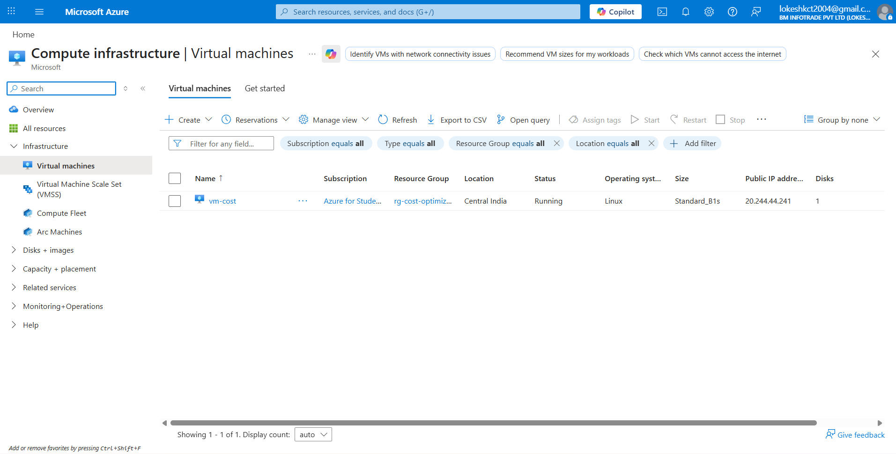
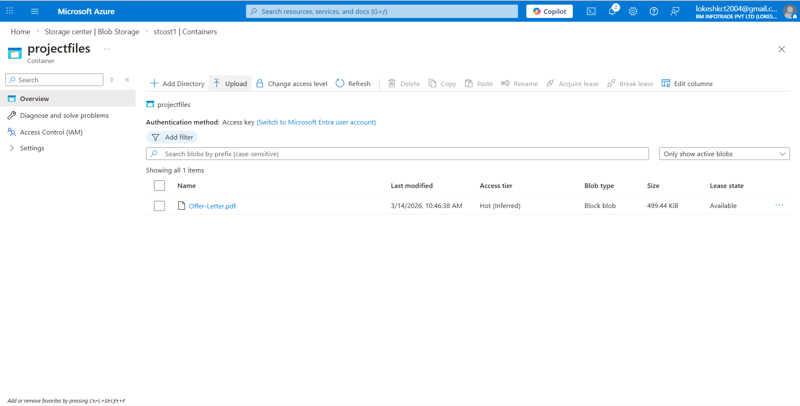
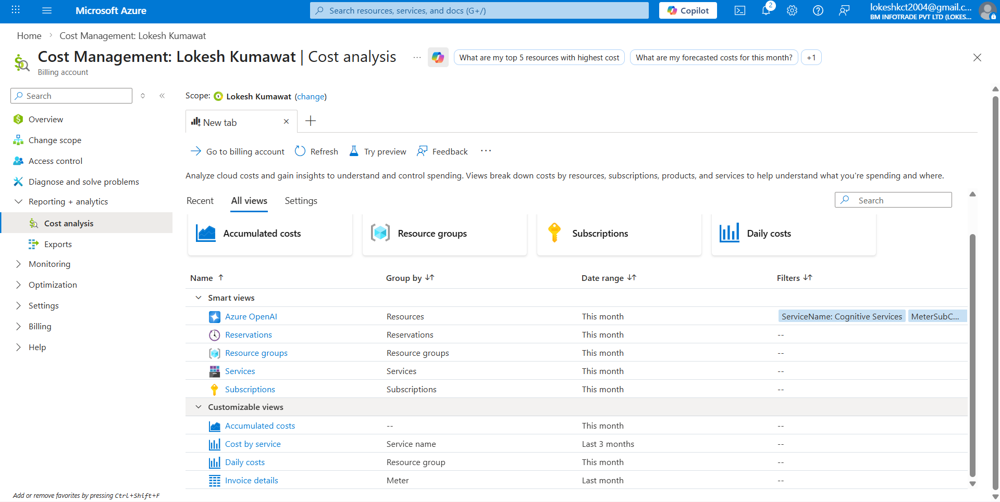
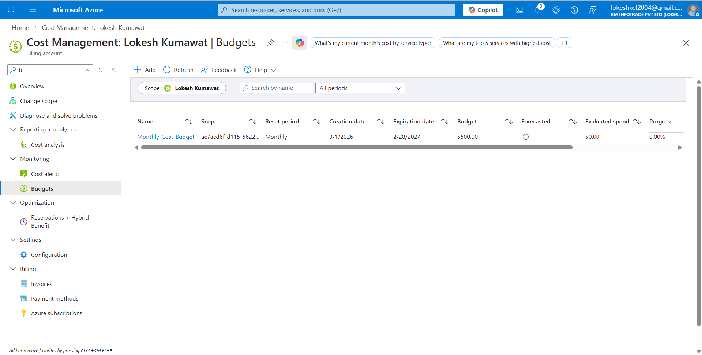
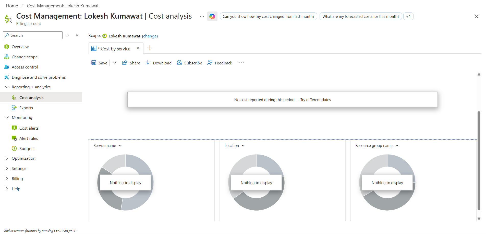
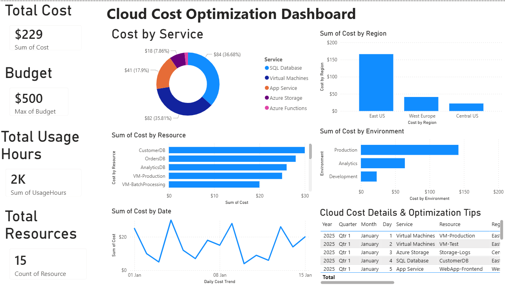

# Azure Cloud Cost Optimization Dashboard

## 📌 Project Overview
The **Azure Cloud Cost Optimization Dashboard** is a Power BI project designed to analyze and monitor cloud resource costs in Microsoft Azure.  
This dashboard helps identify high-cost services, track budget usage, analyze spending trends, and provide optimization insights for better cost management.

The project is useful for:
- Monitoring total cloud spending
- Comparing cost across Azure services
- Analyzing cost by region and environment
- Tracking daily cost trends
- Identifying resources that need optimization

---

## 🎯 Project Objectives
- Build an interactive dashboard for Azure cloud cost analysis
- Track overall cloud spending and budget utilization
- Compare costs across services, regions, and environments
- Identify top expensive resources
- Provide recommendations for cost optimization
- Support decision-making for better cloud resource management

---

## 🛠️ Tools & Technologies Used
- **Power BI Desktop**
- **Microsoft Azure (Cost Management concepts)**
- **CSV Dataset**
- **DAX (Data Analysis Expressions)**

---

## 📂 Dataset Information
The dataset used in this project contains Azure cloud cost-related data such as:
- **Date**
- **Service**
- **Region**
- **Environment**
- **Resource**
- **Cost**
- **Usage Hours**
- **Budget**
- **Optimization Recommendation**

Example services included:
- Virtual Machines
- Azure Storage
- SQL Database
- App Service
- Azure Functions

---

## 📊 Dashboard Pages

### 1️⃣ Main Dashboard
The main dashboard provides a high-level overview of Azure cloud spending.

#### Key Features:
- **Total Cost KPI**
- **Budget KPI**
- **Total Usage Hours KPI**
- **Total Resources KPI**
- **Cost by Service**
- **Cost by Region**
- **Cost by Environment**
- **Cost by Resource**
- **Daily Cost Trend**
- **Optimization Recommendations Table**

---

### 2️⃣ Detailed Analysis Page
The detailed analysis page allows users to interactively filter and explore cloud cost data.

#### Key Features:
- **Region Slicer**
- **Service Slicer**
- **Environment Slicer**
- **Date Slicer**
- **Detailed Cost Charts**
- **Filtered Data Table**

---

## 📈 DAX Measures Used
Some important DAX measures used in the project:

```DAX
Total Cost = SUM(azure_cloud_cost_data[Cost])

Total Budget = MAX(azure_cloud_cost_data[Budget])

Total Usage Hours = SUM(azure_cloud_cost_data[UsageHours])

Total Resources = DISTINCTCOUNT(azure_cloud_cost_data[Resource])

Budget Utilization % = DIVIDE(SUM(azure_cloud_cost_data[Cost]), MAX(azure_cloud_cost_data[Budget]), 0)

```
## 📁 Project Structure
```bash
Azure-Cloud-Cost-Optimization-Dashboard/
│── Azure_Cloud_Cost_Optimization_Dashboard.pbix
│── azure_cloud_cost_data.csv
│── README.md
│── dashboard/
│   ├── powerbi_dashboard.pbix
│── screenshots/
│   ├── vm-instance-running.png
│   ├── blob-storage-container.png
│   ├──cost-analysis-overview.png
│   ├──budget-configuration.png
│   ├── cost-analysis.png
│   ├──  dashboard-powerbi.png


```

## 📸 Project Screenshots

### 🔹 VM Instance Running


### 🔹 Blob Storage Container


### 🔹 Cost Analysis Overview


### 🔹 Budget Configuration


### 🔹 Cost Analysis


### 🔹 Dashboard

